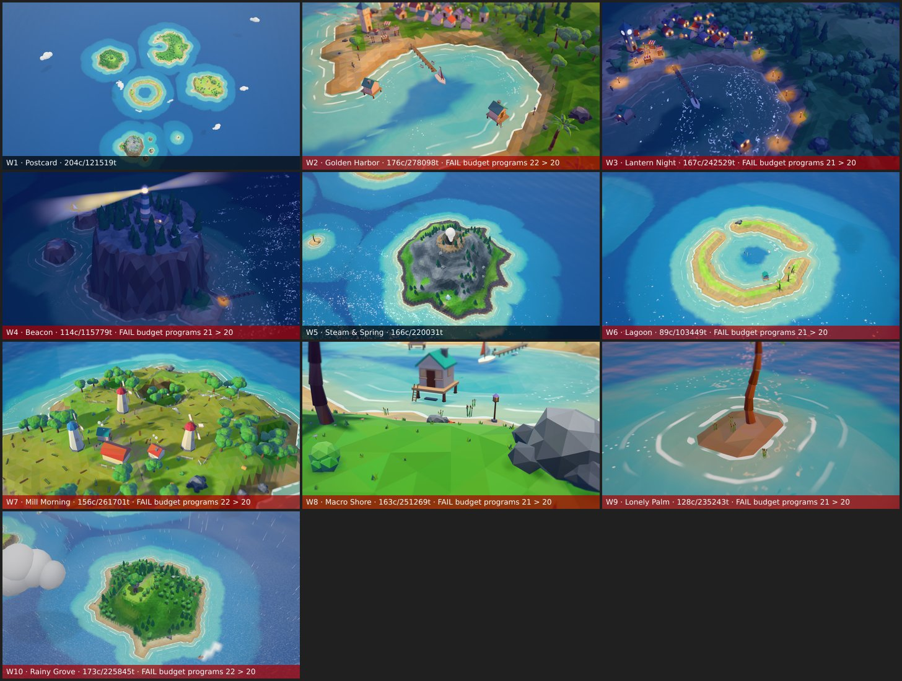

# Marisland

A cute, cozy, fully procedural 3D archipelago in the browser — built with three.js. Five to seven hand-crafted-looking islands generated from a seed: zoom in and the world blooms open, from island silhouettes down to crabs scuttling on the beach. Living boats, gulls, villagers, sheep, cats, dolphins, day/night cycles and weather. **Everything—geometry, textures, creatures—is generated in code with three.js; no external assets. Deterministic: the same seed URL always produces the exact same pixels.**

**Live demo:** https://omergungor11.github.io/marisland/



## Features

### World
- **5–7 procedurally generated islands** per seed, each with a distinct archetype (fishing village, lighthouse, windmill farm, volcano, atoll, forest, sandbar)
- **Island archetypes:** Hearthholm (crescent harbour), Beacon Rock (lighthouse stack), Millbrook (windmill plateau), Emberpeak (volcano), Palmlagoon (atoll), Mossgrove (forest dome), Lonely Palm (sandbar)
- **Settlements** with houses, docks, landmark structures (lighthouse, clocktower, giant tree, crater)
- **Coastal detail:** deep water, turquoise rings, foam bands, wet/dry sand, cliffs, black sand beaches

### Zoom detail ladder (4 tiers)
- **T0 (Map, 380–800 u):** Overview of all islands, cloud shadows, boat dots, labels
- **T1 (Island, 140–380 u):** Trees, cottages, docks, rocks, rowboats, real boats with ripples
- **T2 (Village, 45–140 u):** Bushes, fences, lanterns, villagers, sheep, crabs
- **T3 (Macro, 12–45 u):** Ground cover within 60 u (grass tufts, flowers, shells, reeds, lily pads)

### Living ambient creatures & NPCs
- **Sea:** Sailboats on routes with wakes, moored rowboats, gull flocks that perch, fish schools, jumping fish, dolphins
- **Land:** Villagers walking the path graph (they wave when you get close), sheep flocks on meadows, cats near the houses, crabs on the beach
- **Every instance has its own phase** (never in sync); clicking a tree, house or creature triggers a squash/hop/wobble reaction with a little particle burst

### Day/night & weather
- **Time of day:** Dawn → Golden hour → Dusk → Night, with lerped lighting (warm sun, blue-violet shadows, cozy night luminance)
- **Night:** windows and lanterns switch on one by one, warm lantern pools on the ground, a sweeping lighthouse beam, moon with a glitter streak on the water
- **Weather:** Clear, cloudy, rainy (ripples on water), foggy (mist band near shore); weather cycles automatically or via UI
- **Sky:** Gradient dome with sun, moon, hashed stars; exponential fog that keeps far islands readable

### HUD & controls
- **Dock** (bottom): time dial (drag/scroll to scrub, tap to cycle the bible time stops), weather (clear → cloudy → rain → fog), new seed, photo mode (time + FOV 15–60° sliders, freeze, PNG export), settings (quality, reduce motion, compass, hide HUD)
- **Compass** (top-right): Reset camera to north
- **Island labels** (at T0): Click to fly to an island; auto-hide at closer zoom
- **Keyboard shortcuts:** `h` to hide HUD, `Esc` to exit photo mode, double-click island to fly to it
- **Touch:** one finger pans, two fingers pinch-zoom and twist-rotate, double-tap an island to fly to it

### Performance & budgets
- **Quality tiers:** low (no post-processing), medium (bloom + grade + tilt-shift), high (MSAA + DOF); auto-picked, overridable in settings
- **Governor:** watches the rolling p90 frame time; steps the pixel ratio down first, then caps the detail tier, and upgrades at most once per session
- **Budgets:** Strict per-tier caps on draw calls, triangles, shader programs, and prop instance counts; `pnpm shots --assert` fails if exceeded
- **Context-loss recovery:** the world is rebuilt from its seed when the WebGL context is lost and restored, keeping the camera pose

## Controls

| Action | Method |
|--------|--------|
| **Pan/rotate** | Mouse drag or touch pan |
| **Zoom** | Mouse wheel or pinch |
| **Fly to island** | Double-click island at T0 |
| **Toggle HUD** | Press `h` |
| **Exit photo mode** | Press `Esc` |
| **Click reactions** | Click buildings, trees, creatures |
| **Compass reset** | Click compass icon (top-right) |

## URL Parameters

Query parameters control the view and capture mode. Example: `?seed=1001&time=17:30&quality=high&hud=1`

| Name | Values | Default | What it does |
|------|--------|---------|--------------|
| `seed` | 0–4294967295 | 1001 | Island layout seed (deterministic) |
| `shot` | W1–W10, D-*, or '' | '' | Named capture preset (wow or dev shots) |
| `cam` | overview, island:*name*, village, dock, macro-beach, or x,y,z,tx,ty,tz | '' | Camera position preset or raw coordinates |
| `time` | 0–24 (hours), or HH:MM | — | Game time of day (NaN = real-time) |
| `weather` | clear, cloudy, rain, fog, or '' | '' | Weather state ('' = clear) |
| `simt` | 0–60 (seconds) | 0 | Sim warm-up before first render frame |
| `freeze` | 1 or 0 | 0 | Capture mode (no intro, no governor; RAF stops when ready) |
| `quality` | low, medium, high, or '' | '' | Render quality ('' = auto via governor) |
| `dpr` | 0.5–3 | — | Device pixel ratio override (NaN = auto) |
| `hud` | 1 or 0 | 1 | Show HUD (0 = hide) |
| `debug` | none, stats, mask, overdraw, wire, height, zone, slope, coast | none | Debug visualization overlay |
| `perf` | 1 or 0 | 0 | Fly a fixed 10 s path and report p50/p95 frame, CPU and GPU times (`__marisland.perf()`) |
| `selftest` | regen, rebuild, ctxloss, or '' | '' | Self-tests: `regen` runs 5 seed cycles and asserts no GPU leak; `ctxloss` loses and restores the WebGL context |
| `intro` | 1 or 0 | 1 | Play intro animation (0 = skip) |
| `rm` | 1 or 0 | 0 | Force reduced motion (longer fades, no bloom-in pop) |
| `gallery` | 1 or 0 | 0 | Prop gallery scene instead of the world (for model review) |
| `panel` | photo, settings, or '' | '' | Open that HUD panel at boot (for screenshots) |
| `introt` | seconds | — | With `freeze=1`: freeze the opening sequence at this time |

*Capture/debug only:* `freeze`, `shot`, `simt`, `selftest`, `perf`, `panel`, `introt`, `debug`, `gallery`.

## Getting started

### Requirements
- Node.js ≥ 22.12
- pnpm ≥ 10.28.0

### Install and run
```bash
pnpm install

# Development server (http://localhost:5173)
pnpm dev

# Build and preview (uses VITE_BASE=/marisland/ for GitHub Pages)
pnpm build && pnpm preview

# Type check, lint, and test
pnpm typecheck && pnpm lint && pnpm test

# Screenshot capture with deterministic headless rendering
pnpm shots [ci|dev|wow] [--assert] [--tag=<name>] [--port=<port>] [--no-selftest]
  # ci:   4 shots, 640×360, low quality (PR checks)
  # dev:  23 dev shots, 960×540 (milestone review; includes HUD and phone layouts)
  # wow:  W1–W10 hero shots, 1920×1080, medium quality
  # --assert: fail if budgets exceeded
  # --tag=<name>: parallel run (isolates dist-<name>/, shots/<set>-<name>/)
  # --port=<port>: preview server port (use a unique one per parallel run)
  # --no-selftest: skip the regen / context-loss self-tests
```

## Project structure

```
src/
  core/          Clock, frame loop, RNG (label-fork), noise, scope/dispose, params, quality tiers
  world/         Deterministic world data generation (no three.js imports; runs in Node/Worker)
  content/       ART_BIBLE tables → config (palette, archetypes, prop definitions, budgets, shots)
  geo/           Procedural mesh builders (bevelled, faceted, vertex-coloured, LOD variants)
  render/        Backend, materials, shaders, terrain/water/sky/clouds, prop batcher, shadows, post
  detail/        Zoom-tier FSM, fade/pop scheduler, LOD swaps
  life/          Agents (boats, villagers, critters, gulls, fish, sheep, cats, dolphins, crabs)
  anim/, env/    Animation catalog, environmental state (time, weather, lighting)
  camera/        Camera controls, presets, pitch curve
  interact/      Click picking and creature reactions
  ui/            HUD, photo mode, settings panel
  capture/       Deterministic screenshot harness
  debug/         Stats overlay and dev tools

scripts/
  shots.ts       Playwright headless capture harness + contact-sheet generator

mar-docs/
  shots/         Milestone contact sheets (M1.jpg, M2.jpg, …)
  ART_BIBLE.md   Visual target (style pillars, palette, islands, props, zoom tiers, wow shots)
  VISUAL_QA.md   Screenshot acceptance criteria and how to evaluate shots
  DECISIONS.md   Architecture decisions (D-001…D-016) with dates and rationale
  MEMORY.md      Project gotchas, patterns, known issues

mar-plans/
  PROMPT.md      Initial build prompt (vision, constraints, workflow)
  ARCHITECTURE.md Systems and pipeline (module tree, world gen, rendering, LOD, budgets, phases)

mar-config/
  tech-stack.md  Versions and dependencies (pinned: three 0.186.1, pmndrs 6.39.5)
  conventions.md TypeScript, module boundaries, determinism rules, testing, formatting
```

**Key docs:**
- [`mar-plans/ARCHITECTURE.md`](mar-plans/ARCHITECTURE.md) — How the engine is built
- [`mar-docs/ART_BIBLE.md`](mar-docs/ART_BIBLE.md) — What it looks like (palette, style, creatures, animations)
- [`mar-docs/VISUAL_QA.md`](mar-docs/VISUAL_QA.md) — Screenshot acceptance criteria
- [`mar-docs/DECISIONS.md`](mar-docs/DECISIONS.md) — Architectural decisions with rationale
- [`mar-docs/MEMORY.md`](mar-docs/MEMORY.md) — Project gotchas and patterns
- [`mar-tasks/task-index.md`](mar-tasks/task-index.md) — Task board (phases, milestones, dependencies)

## Tech stack

**Runtime:** Node ≥ 22.12, pnpm ≥ 10.28.0

**App:** three.js r186 (WebGL2) · camera-controls · pmndrs postprocessing (bloom, tilt-shift, DOF, SMAA/FXAA) · simplex-noise · @fontsource fonts (Fredoka, Nunito)

**Tooling:** Vite 8 · TypeScript strict · ESLint (determinism rules) · Prettier · Vitest

**Testing & capture:** Playwright 1.56 (Chromium 141 + SwiftShader for deterministic headless screenshots) · pixelmatch · sharp

**Hosting:** GitHub Pages (deployed on push to `main`)

## Status

**Phase 1 — Living diorama:** M1–M10 implemented (hardening in progress: program-budget audit and the 10-seed sweep).

**Phase 2 — Sandbox editing:** Planned for future development (terrain brush, prop place/remove/move, undo/redo, save/share).
