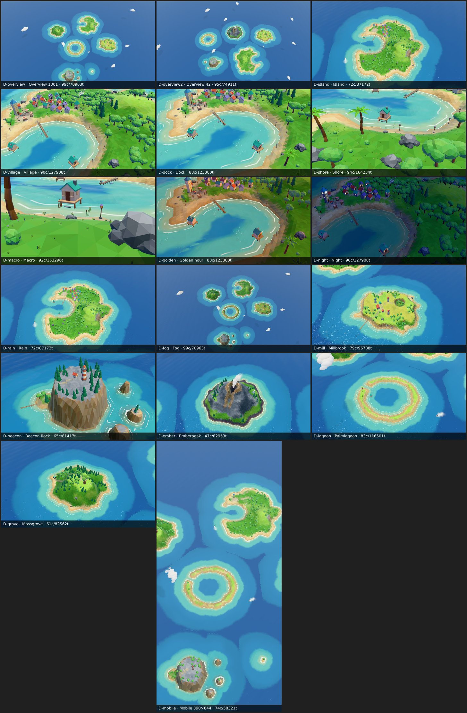

# Marisland

A cute, cozy, fully procedural 3D archipelago in the browser — built with three.js. Five to seven hand-crafted-looking islands generated from a seed: zoom in and the world blooms open, from island silhouettes down to crabs scuttling on the beach. Living boats, gulls, villagers, day/night and weather. No downloaded assets: every mesh and texture is generated in code.

**Live demo:** https://omergungor11.github.io/marisland/



## Features

- **Procedural generation**: 5–7 island archetypes (fishing villages, lighthouses, windmills, volcanoes, atolls, forests, sandbars) from a deterministic seed
- **Zoom tiers**: map view → macro lens; each tier reveals detail (trees → rocks → wind sway)
- **Living world**: sailboats on routes, moored rowboats, gull flocks, fish schools, dolphins, chimney smoke, volcano steam
- **Stylized rendering**: faceted low-poly terrain with baked AO, depth-banded water with shore foam and moon glitter, soft shadows, warm/cool lighting, bloom, tilt-shift, vignette
- **Day/night cycle**: 600 s/day with automatic window and lantern glows; customizable with `time` param
- **Determinism**: same URL → same pixels; Playwright + SwiftShader harness for pixel-perfect QA
- **Photo mode**: PNG export with HUD toggle

## Try it

| Param | Values | Example |
|---|---|---|
| `seed` | number | `?seed=42` |
| `time` | hours or h:mm | `?time=18:30` or `?time=20` |
| `cam` | `overview`, `island:<name>`, `village`, `dock`, `shore`, `macro-beach` | `?cam=island:Hearthholm` |
| `quality` | `low`, `medium`, `high` | `?quality=high` |
| `intro` | 0 | `?intro=0` |
| `hud` | 0 | `?hud=0` |
| `freeze` | 1 | `?freeze=1` |
| `debug` | `stats`, `mask`, `wire` | `?debug=stats` |
| `gallery` | 1 | `?gallery=1` |
| `perf` | 1 | `?perf=1` |

## Controls

- **Pan**: left-drag
- **Rotate**: right-drag
- **Zoom**: mouse wheel to cursor
- **Fly to island**: double-click label or island
- **Skip intro**: any key or mouse input

## Development

```bash
pnpm install
pnpm dev                                    # http://localhost:5173
pnpm typecheck && pnpm lint && pnpm test
pnpm shots dev                              # contact sheet (ci/wow variants)
pnpm build && VITE_BASE=/marisland/ pnpm preview
```

## Docs

| Doc | What |
|---|---|
| [`mar-docs/ART_BIBLE.md`](mar-docs/ART_BIBLE.md) | Look & motion: palette, islands, props, zoom tiers, animation, reference shots |
| [`mar-plans/ARCHITECTURE.md`](mar-plans/ARCHITECTURE.md) | Systems: world generation, rendering, LOD, capture/QA, budgets, phases |
| [`mar-docs/VISUAL_QA.md`](mar-docs/VISUAL_QA.md) | Acceptance criteria and wow shots checklist |
| [`mar-docs/DECISIONS.md`](mar-docs/DECISIONS.md) | Architectural decisions and rationale |
| [`mar-tasks/task-index.md`](mar-tasks/task-index.md) | Milestone and task tracker |

## Status

**Phase 1 in progress.** M1–M4 (Phase 0 core content) live. M5–M6 (gameplay, intro, HUD), M7–M8 (weather, photo, polish) partially done. M9 (Phase 2 sandbox) backlog.

## Stack

Vite · TypeScript · three.js r186 (WebGL2) · pmndrs postprocessing · camera-controls · Vitest · Playwright (headless screenshot QA)
